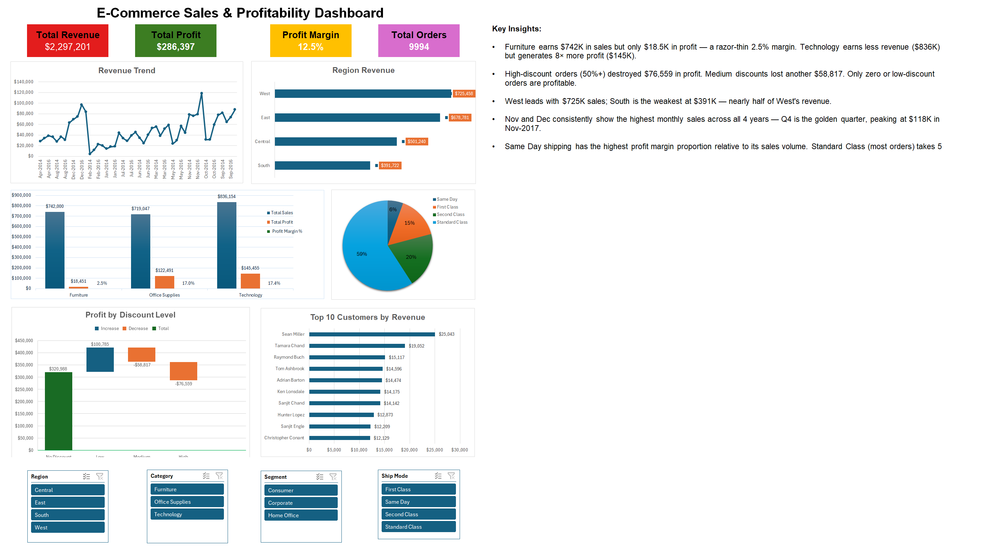

# E-commerce Order Profitability Dashboard (Excel)

An interactive and dynamic Excel dashboard built using the Sample Superstore E-commerce dataset.  
This project analyzes sales, profit, customer behavior, shipping performance, and discount impact using Pivot Tables, Pivot Charts, KPI Cards, and Slicers.

---

# Project Overview

This dashboard was created to transform raw e-commerce transactional data into meaningful business insights using Microsoft Excel.

The dashboard helps answer important business questions such as:

- Which region generates the highest revenue?
- Which product category is the most profitable?
- How do discounts affect profit?
- Which shipping mode performs best?
- Who are the top revenue-generating customers?
- How are sales trending over time?

---

# Dashboard Features

## Dashboard Preview



## KPI Cards
The dashboard includes dynamic KPI cards for:

- Total Revenue
- Total Profit
- Total Orders
- Profit Margin %

These KPIs update automatically using slicers and pivot table connections.

---

## Revenue Trend Analysis
Monthly revenue trend visualization using line charts to identify:

- Seasonal sales spikes
- Revenue growth patterns
- Business performance trends

---

## Region-wise Revenue Analysis
Analyzes sales performance across regions to identify:

- Highest-performing regions
- Revenue distribution
- Regional business opportunities

---

## Profit Margin by Category
Compares profitability across product categories to determine:

- High-margin categories
- Low-profit categories
- Business optimization opportunities

---

## Discount Impact on Profit
Analyzes how discount levels affect profitability.

Key insight:
> Higher discounts increase sales volume but reduce overall profit margins.

---

## Shipping Mode Analysis
Compares shipping methods using:

- Revenue
- Profit
- Average Shipping Days

Helps evaluate operational efficiency and customer delivery preferences.

---

## Top 10 Customers Analysis
Identifies the highest revenue-generating customers using ranking analysis.

Useful for:
- Customer retention strategies
- High-value customer targeting
- Revenue concentration analysis

---

# Tools & Technologies Used

- Microsoft Excel
- Pivot Tables
- Pivot Charts
- Slicers
- KPI Cards
- Dynamic Excel Tables

---

# Workbook Structure

```text
Workbook
│
├── Raw_Data
├── Pivot_Tables
└── Dashboard
